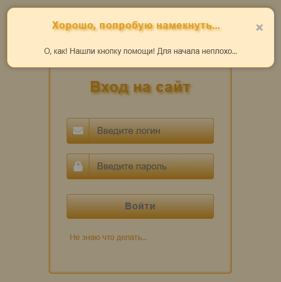

# CTF-Task - Login In Site. Практическое задание для джунов. Нужно суметь залогиниться на этом фейковом сайте.



## Краткое описание
При открытии главной страницы сайта перед пользователем откроется форма авторизации, в которой необходимо ввести валидные логин и пароль. После того, как правильные креды (логин и пароль) будут введены, перед пользователем откроется форма для ввода PIN-кода, в которой нужно ввести валидный PIN-код. После ввода валидного PIN-кода задача считается выполненной.

Для решения задачи никаких специальных инструментов кроме DevTools использовать нет необходимости.

Демо-сайт в сети: https://juniorday.hitsecurity.ru/   (При необходимости может быть временно отключен мной по некоторым причинам. I'm sorry.)

## Как запустить сайт локально с использованием Docker и Docker Compose

Перейти в директорию с исходниками сайта и выполнить команду

```bash
sudo docker-compose up -d
```

или

```bash
sudo docker compose up -d
```

После запуска Docker-контейнера сайт будет доступен локально по адресу http://127.0.0.1:43003

*Или измените файлы Dockerfile и docker-compose.yml по своему усмотрению и запускайте так, как считаете нужным.*


## Подробнее о таске, а также о заложенных в нем багах и подсказках:

- Все логины и пароли захардкожены в исходниках на бэкенде. Они могут находиться в любом файле, каким-то образом относящимся к данному сайту. И даже в изображениях.

- Под формой авторизации, справа от надписи "Не знаю что делать..." имеется невидимая кнопка, нажимая на которую пользователю будут показываться подсказки о том, в какую сторону ему двигаться для решения задачи.

- Форма авторизации имеет фоновое изображение, на котором в открытом виде изображен один из валидных кредов. При этом фоновое изображение по умолчанию перекрыто сплошным цветом. Если в DevTools отключить эту заливку сплошным цветом, то увидим фоновое изображение с нужными нам данными.

- В форме авторизации поле ввода пароля ограничено до 10 символов. При этом все захардкоженые пароли имеют длину более 10 символов. Чтобы ввести корректный пароль нужно это дело исправить. Подсказка об этом имеется в коде страницы в виде комментария.

- Также в коде страницы в виде комментария в чистом виде спрятан еще один из вариантов валидного логина. А пароль для этого валидного логина спрятан в виде комментария в подключенном CSS-файле. Для усложнения задания этот пароль закодирован в Base64.

- После ввода валидных кредов в форме авторизации пользователю будет нужно ввести корректный пин-код, который также захардкожен в исходнике бэка (1973). Обращаю внимание, что при открытии страницы с формой ввода пин-кода, фон страницы обновился. На этом фоне есть явный намек на перевод из двоичной системы исчисления в десятичную. Сам пин-код в двоичной системе исчисления также содержится на этом фоновом изображении.

- Задача считается выполненной после ввода всех валидных кредов - логина, пароля и пин-кода.
