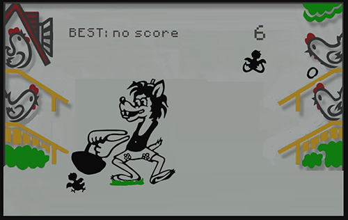

# Игра "Волк ловит яйца" (со специально заложенными багами) / Game Wolf and eggs with bugs (for bugs find)

***Примечание:** Игра написана не мной, а взята здесь (ссылка на оригинальный репозиторий: https://github.com/almasklchv/wolf-catches-eggs). Я лишь специально добавил в исходный код несколько багов.*



Ссылка на инструкцию и мини-видеообзор: https://disk.yandex.ru/i/KxVwtcO6po6oag

## Краткое описание

Игра "Волк ловит яйца", в которой специально заложены несколько багов. Суть в том, чтобы пользователи нашли все заложенные баги. Игра написана полностью на JavaScript. Еще раз - игру писал не я. Я только баги в нее специально заложил.

Для решения задачи (поиска багов) никаких специальных инструментов кроме DevTools и собственной внимательности использовать нет необходимости.

Демо-сайт в сети: https://wolf.hitsecurity.ru/   (При необходимости может быть временно отключен мной по некоторым причинам. I'm sorry.)


## Как запустить сайт локально с использованием Docker и Docker Compose

Перейти в директорию с исходниками сайта и выполнить команду

```bash
sudo docker-compose up -d
```

или

```bash
sudo docker compose up -d
```

После запуска Docker-контейнера сайт будет доступен локально по адресу http://127.0.0.1  (на 80-м порту)

*Или измените файлы Dockerfile и docker-compose.yml по своему усмотрению и запускайте так, как считаете нужным.*


## Подробнее о таске, а также о заложенных в нем багах:

- С правой стороны "курятника" яйца катятся не совсем правильно. Да, они катятся вниз, но вращаются они по часовой стрелке, хотя по здравому должны вращаться против часовой стрелки.

- После прохождения игры несколько раз (без обновления страницы в браузере), в консоли DevTools начинают сыпаться бесконечные ошибки, и при следующих запусках игра ведет себя неадекватно до тех пор пока жестко не перезагрузишь страницу с игрой.

- При вводе имени игрока в начале игры, если фокус установлен на поле ввода, а не на кнопке "Дальше", то нажатие на кнопку "Enter" на клавиатуре ни к чему не приводит. Не так, чтобы это баг, но UX подпорчен.

- При выборе уровня сложности игры, уровни "Легкий" и "Сложный" перепутаны местами. В UI эти уровни сложности расположены в правильном порядке слева направо, а вот в исходном коде перепутаны обработчики. То есть, если пользователь выберет "Легкий" уровень сложности, то игра запустится с уровнем "Сложный" и, соответственно, наоборот.

- На уровне сложности "Сложный" игра ведет себя порой просто неадекватно - игра может завершиться даже всего лишь с одним непойманным яйцом.

- Кнопки управления. На главной странице игры для управления игровым процессом задокументированы кнопки Q (слева вверху), A (слева внизу), E (справа вверху) и D (справа внизу). При этом в коде игры прописаны кнопки Q, A и P, L. То есть, кнопки E и D по факту не работают.

- Кнопки управления. Яйца с верхней левой полки-насеста поймать невозможно, волк просто туда не подставляет корзину, хотя по факту кнопка Q работает, просто она переводит волка в ту же позицию, что и кнопка A.

- Во время игры должна играть фоновая музыка. В игре представлены 5 (пять) разных музыкальных композиций, которые выбираются игрой рандомно. Все файлы с музыкой имеют такие имена: 1.mp3, 2.mp3, 3.mp3, 4.mp3 и 5.mp3. При этом в исходном коде игры некоторые файлы прописаны вот в таком виде: 02.mp3, 03.mp3 и т.д. (добавлен "ноль") и, естественно, они не загружаются, выдавая 404-й статус-код. Игра от этого не падает, но ошибки в консоль DevTools валятся.

- На игровом поле некорректно работает Best Scores. По задумке здесь должен отображаться наилучший результат для текущего игрока (естественно, если он уже играл ранее), но этот результат отображается некорректно. Где-то в исходном коде некорректно названа переменная, которая отвечает за Best Scores. Данные сохраняются в Local Storage.

- На игровом поле справа от Best Scores отображается счетчик времени игры в секундах. Хотя, по задумке, с учетом оригинальной железячной игры, здесь должен отображаться счетчик пойманных яиц. Этот баг неочевиден, конечно - а вдруг так и задумали разработчики, но все же с точки зрения здравого смысла здесь должен быть счетчик пойманных яиц.
